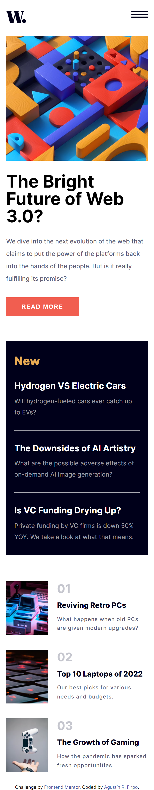
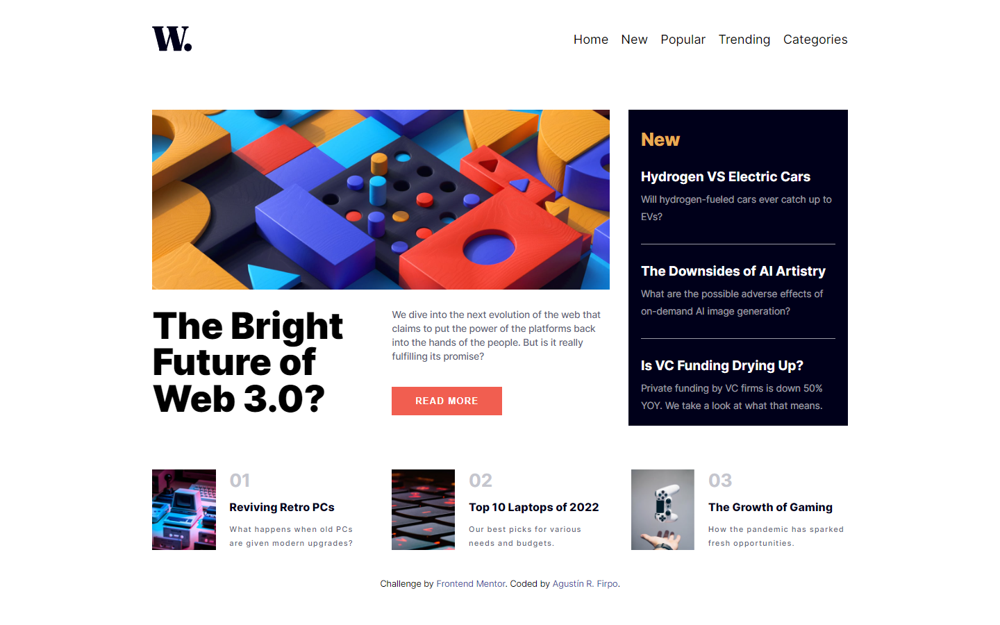
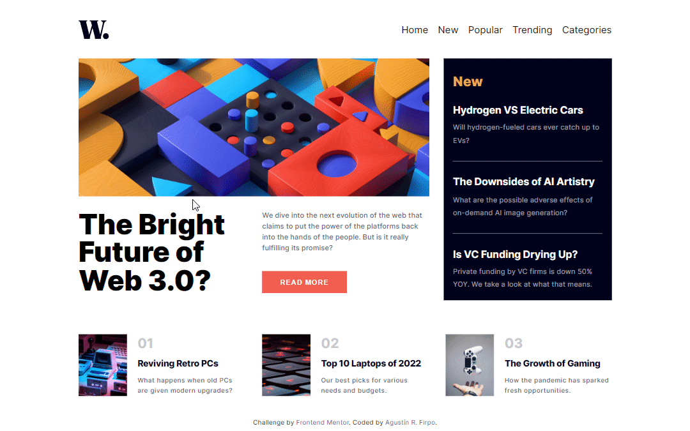

Hi everybody! 👋

# Frontend Mentor - News homepage solution

This is a solution to the [News homepage challenge on Frontend Mentor](https://www.frontendmentor.io/challenges/news-homepage-H6SWTa1MFl). 

## Table of contents  🧾

- [Frontend Mentor - News homepage solution](#frontend-mentor---news-homepage-solution)
  - [Table of contents  🧾](#table-of-contents--)
  - [Overview](#overview)
    - [The challenge  🎯](#the-challenge--)
    - [Links  🔗](#links--)
  - [My process ⚙️](#my-process-️)
    - [Built with 🛠️](#built-with-️)
  - [Author  🙋🏻‍♂️](#author--️)

## Overview

### The challenge  🎯

Users should be able to:

- View the optimal layout for the interface depending on their device's screen size

Mobile Layout 📱

Desktop LAyout 💻

- See hover and focus states for all interactive elements on the page

### Links  🔗

- Solution URL: [Github Repository](https://github.com/Arfirpo/news-homepage-main)
- Live Site URL: [Github Page](https://arfirpo.github.io/news-homepage-main/)

## My process ⚙️

### Built with 🛠️

- Semantic HTML5 markup
- CSS custom properties
- Flexbox
- CSS Grid
- Mobile-first workflow
- [Sass](https://sass-lang.com/) - Css Pre-processor

## Author  🙋🏻‍♂️

- Twitter/X - [@agus_firpo](https://twitter.com/agus_firpo)
- Frontend Mentor - [@Arfirpo](https://www.frontendmentor.io/profile/Arfirpo)
- Linkedin - [Agustín Rodrigo Firpo](https://www.linkedin.com/in/agustin-rodrigo-firpo-0aa86697/)